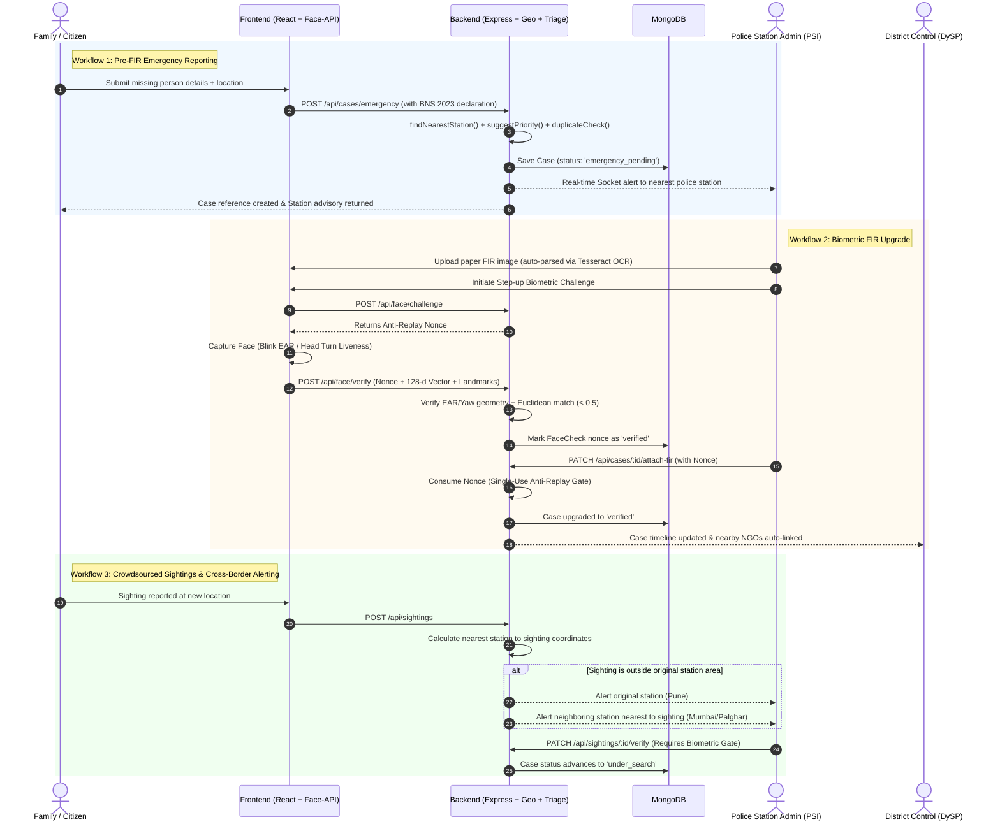

# Project Rakshak: Comprehensive System Overview & Presentation Guide

---

## 1. Executive Summary & The Big Picture

**Project Rakshak** is an enterprise-grade, multi-tier **Missing Person Coordination & Investigation Platform** built on the MERN stack (MongoDB, Express, React, Node.js) with client-side AI/ML, real-time WebSockets, and geospatial intelligence.

### The Core Problem It Solves
- **The Golden Hours Dilemma:** In missing persons investigations, the first 24–48 hours are critical. Traditional processes require physical paperwork, manual police jurisdiction verification, and delays in issuing an official First Information Report (FIR).
- **Jurisdictional Silos:** If a child goes missing in Pune and is sighted in Mumbai or Palghar, inter-station alerting traditionally takes days of inter-departmental bureaucracy.
- **Unverified Crowdsourcing:** Public tips and sightings are often chaotic, unvetted, and vulnerable to misinformation or false claims.
- **Officer Accountability & Integrity:** Sensitive case updates and sighting verifications must be protected against credential sharing, unauthorized tampering, and fake report filings.

### The Rakshak Solution
Rakshak unifies **Citizens**, **Families**, **NGOs**, **Police Stations**, **District Control Rooms (DySP level)**, and **State/National Administrators** into a single synchronized command-and-control network. It combines:
1. **Pre-FIR Emergency Reporting** with legal accountability under **Section 217 of Bharatiya Nyaya Sanhita (BNS), 2023**.
2. **Automated Geospatial Routing** using MongoDB 2dsphere indexing and Haversine spatial calculations.
3. **Transparent Risk-Based Priority Triage** (algorithmic scoring with human-readable rationale).
4. **Pre-submission Duplicate Detection** using Levenshtein distance and spatial-temporal heuristics.
5. **In-Browser OCR (Tesseract.js)** for instant physical FIR digitization.
6. **Zero-Trust Biometric Step-Up Authentication** (Face-API embeddings, anti-replay nonces, EAR blink/head-turn liveness detection, and auto-suspension).

---

## 2. Technology Stack & Architectural Overview

```
                                    +-----------------------------------+
                                    |     Rakshak Frontend (React 18)   |
                                    |   Vite + React Router + Leaflet   |
                                    |  @vladmandic/face-api + Tesseract |
                                    +-----------------+-----------------+
                                                      |
                                          REST APIs / WebSockets
                                                      |
                                    +-----------------v-----------------+
                                    |     Rakshak Backend (Node/Express)|
                                    |  JWT Auth + RBAC + Audit Logging  |
                                    |   Socket.io + Rate Limiting       |
                                    +-----------------+-----------------+
                                                      |
                       +------------------------------+-------------------------------+
                       |                                                              |
        +--------------v--------------+                               +---------------v---------------+
        |    MongoDB Atlas / Engine   |                               |      Local Filesystem / S3    |
        |  2dsphere Geo Indices       |                               |      Secure Upload Vault      |
        |  TTL Nonces & Audit Logs    |                               |      Case Evidence & Photos   |
        +-----------------------------+                               +-------------------------------+
```

### 1. Frontend Layer
- **Framework:** React 18 with [Vite](file:///e:/Code/rakshak/rakshak/frontend/package.json).
- **Styling:** Custom Vanilla CSS design tokens with status pills, badges, responsive cards, and dark/light UI accents.
- **Mapping & Geolocation:** [Leaflet](file:///e:/Code/rakshak/rakshak/frontend/src/components/CaseMap.jsx) & [React-Leaflet](file:///e:/Code/rakshak/rakshak/frontend/src/components/SightingMap.jsx) for interactive incident and sighting mapping.
- **Client-Side AI/ML:**
  - `@vladmandic/face-api`: In-browser WebGL/WASM neural network inference for 128-dimensional face embedding extraction and landmark detection (no heavy native Python/TensorFlow required on backend).
  - `tesseract.js`: Browser-side optical character recognition with 2x canvas scaling, grayscale conversion, and contrast enhancement.

### 2. Backend Layer
- **Runtime:** Node.js & Express.
- **Database:** MongoDB via Mongoose with `2dsphere` spatial indexing.
- **Real-Time Communication:** [Socket.io](file:///e:/Code/rakshak/rakshak/backend/utils/socket.js) for instantaneous notification dispatch and live officer messaging.
- **Security & Hardening:** Helmet, express-rate-limit, bcryptjs password hashing, JWT with custom role level verification.

---

## 3. Administrative Roles & Hierarchy Matrix

Rakshak implements a 9-role, 5-tier Role-Based Access Control ([RBAC](file:///e:/Code/rakshak/rakshak/frontend/src/roles.js)) model:

| Level | Role | Scope / Authority | Key Permissions & Responsibilities |
|---|---|---|---|
| **100** | **Super Admin** | National Level | Platform-wide visibility, system configuration, national analytics, top-tier oversight. |
| **90** | **System Admin** | Technical / Platform | Technical maintenance, managing official users, reviewing raw [AuditLog](file:///e:/Code/rakshak/rakshak/backend/models/AuditLog.js) entries. |
| **80** | **State Control** | State Level (e.g., Maharashtra) | Statewide case oversight, state analytics, cross-district incident reallocations. |
| **70** | **District Control** | District Level (DySP level) | Approves officer biometric face enrollments, reassigns cases across stations, closes cold cases with reason, oversees district duty roster. |
| **60** | **Police Station Admin** | Station Level (PSI level) | Registers official FIR cases, upgrades emergency reports via `attachFir`, reviews pending sightings, requires biometric face verification for sensitive actions. |
| **30** | **NGO Admin** | Service Area Radius (e.g., 25km) | Mobilizes search teams, manages volunteers, auto-linked to cases via proximity. |
| **20** | **NGO Volunteer** | Assigned Case Ops | Field search operations, ground intelligence, sighting verification assistance. |
| **10** | **Family** | Case Reporter / Complainant | Files pre-FIR Emergency Reports, updates timeline/photos/documents, direct chats with investigating officer. |
| **10** | **Citizen** | Public Crowdsource | Submits sightings with GPS & photos, searches non-restricted verified missing cases. |

---

## 4. Key Workflows: How the System Operates



### Detailed Breakdown of Workflows

#### 1. Emergency Pre-FIR Self-Reporting ([EmergencyReport.jsx](file:///e:/Code/rakshak/rakshak/frontend/src/pages/EmergencyReport.jsx))
- A distressed family member can submit an emergency report without waiting for an official FIR number.
- **Section 217 BNS 2023 Deterrent:** Includes a legally binding declaration acknowledging that knowingly submitting false reports to a public servant is a criminal offense.
- **Spam Control:** Enforces a 30-day cooldown per account (exempting designated testing accounts).
- **Auto-Routing:** The backend executes [`findNearestStation(lat, lng)`](file:///e:/Code/rakshak/rakshak/backend/utils/findNearestStation.js) and maps the incident directly to the jurisdiction station with fallback to District Control.

#### 2. Official Case Registration & OCR FIR Extraction ([OcrFirUpload.jsx](file:///e:/Code/rakshak/rakshak/frontend/src/components/OcrFirUpload.jsx))
- Police officers can upload a physical FIR scan.
- Tesseract.js runs inside the browser with custom image preprocessing:
  $$\text{Canvas Scale} = 2\times, \quad \text{Grayscale} = 0.299R + 0.587G + 0.114B, \quad \text{Contrast Factor} = \frac{259(C + 255)}{255(259 - C)}$$
- Automatically parses: Missing Person Name, FIR Number, Age, Last Seen Location, and Complainant Phone.

#### 3. Algorithmic Risk Triage ([priority.js](file:///e:/Code/rakshak/rakshak/backend/utils/priority.js))
Rather than a "black-box" AI, Rakshak uses an explainable, transparent clinical scoring algorithm:
- **Age Vulnerability:**
  - Children $\le 12$ years: $+3$ points
  - Minors $13\text{--}17$ years: $+2$ points
  - Elderly $\ge 65$ years: $+2$ points
- **Time Criticality (Golden Hours):**
  - Reported within $\le 6$ hours: $+2$ points
  - Reported within $\le 24$ hours: $+1$ point
- **Triage Result:** Score $\ge 4 \rightarrow \text{Critical}$, Score $\ge 2 \rightarrow \text{High}$, otherwise $\text{Medium}$ or $\text{Low}$. Every score includes an audit list of reasons, and officers can manually override suggestions with justification.

#### 4. Pre-submission Duplicate Detection ([duplicateDetection.js](file:///e:/Code/rakshak/rakshak/backend/utils/duplicateDetection.js))
Before filing a case, the system evaluates potential duplicates against all active cases using a multi-dimensional scoring function:
$$\text{Score} = 0.55 \cdot S_{\text{name}} + 0.15 \cdot S_{\text{age}} + 0.15 \cdot S_{\text{distance}} + 0.15 \cdot S_{\text{time}}$$
- **Levenshtein String Distance ($S_{\text{name}}$):** Normalized $0\text{--}1$ score, threshold $\ge 0.72$ (tolerant to single-character OCR scanning errors).
- **Age Window ($S_{\text{age}}$):** Within $\pm 3$ years.
- **Geographic Proximity ($S_{\text{distance}}$):** Within $25\text{ km}$ (using spherical Haversine formula).
- **Time Offset ($S_{\text{time}}$):** Within $45\text{ days}$.
- If a match is detected, the UI displays [DuplicateWarning.jsx](file:///e:/Code/rakshak/rakshak/frontend/src/components/DuplicateWarning.jsx) with match reasons, allowing the user to view the existing case or confirm their unique report.

#### 5. Real-Time Sighting & Cross-Jurisdictional Alerting ([sightingController.js](file:///e:/Code/rakshak/rakshak/backend/controllers/sightingController.js))
- When a citizen logs a sighting, the system performs a `$near` geospatial query ($50\text{ km}$ radius) on the `PoliceStation` collection.
- If a sighting occurs near **Bandra (Mumbai)** for a case registered in **Deccan Gymkhana (Pune)**:
  - Both stations are instantly alerted via Socket.io and notification badges.
  - Nearby registered NGOs ([ngoInvolvement.js](file:///e:/Code/rakshak/rakshak/backend/utils/ngoInvolvement.js)) within their configured service radius are automatically attached.

---

## 5. Biometric Liveness & Anti-Replay Architecture

A standout engineering feat of Rakshak is its zero-trust biometric layer:

```
[Browser Client]                                              [Backend Server]
      |                                                              |
      | 1. Request Challenge Nonce --------------------------------->| Generates cryptographically
      |<---------------- 2. Returns Nonce + Expiry (TTL) ------------| random 32-byte nonce
      |                                                              | (Stored in FaceCheck, stage: 'pending')
      | 3. Live Camera Stream & Non-Overlapping Polling Loop         |
      |    - Eye Aspect Ratio (EAR) Blink Transition OR              |
      |    - Landmark-based Head Turn Yaw Geometry                   |
      |    - 128-d Vector Descriptor via WebGL Face-API              |
      |                                                              |
      | 4. Submit Frames Landmark Coordinates + Nonce + Vector ----->|
      |                                                              | 5. Server-Side Verification:
      |                                                              |    a. Recomputes EAR/Yaw from RAW landmarks
      |                                                              |    b. Verifies Relative Baseline Drop (<=72%)
      |                                                              |    c. Euclidean Vector Distance against
      |                                                              |       Enrolled Reference Angles (Cutoff < 0.5)
      |                                                              |    d. Checks Staticness Forensic Signal
      |<---------------- 6. Verification Status ---------------------| 7. Promotes Nonce to stage: 'verified'
      |                                                              |
      | 8. Execute Protected Action (e.g., attachFir) with Nonce --->| 9. FaceGate Middleware:
      |                                                              |    a. Checks Nonce stage == 'verified'
      |                                                              |    b. Instantly DELETES Nonce (Single-Use!)
      |<---------------- 10. Action Completed & Audited -------------|    c. Executes Controller Logic
```

### Technical Safeguards
1. **Never Trust Client Booleans:** The client never sends `isLivenessPassed: true`. It sends raw coordinates $[x, y]$ of eye and jaw landmarks. The server independently calculates EAR:
   $$\text{EAR} = \frac{\|p_2 - p_6\| + \|p_3 - p_5\|}{2 \cdot \|p_1 - p_4\|}$$
2. **Relative Adaptive Thresholds:** Absolute EAR cutoffs fail due to varying eye shapes and camera lighting. Rakshak requires a relative drop:
   $$\text{Closed EAR} \le 0.72 \times \text{Open Baseline EAR}$$
3. **No Heavy ML on Backend:** The backend runs pure vector arithmetic ([faceMatch.js](file:///e:/Code/rakshak/rakshak/backend/utils/faceMatch.js)):
   $$D(a, b) = \sqrt{\sum_{i=1}^{128} (a_i - b_i)^2} \quad (< 0.5)$$
   This eliminates fragile Python/TensorFlow native bindings on the server while preserving strict cryptographic and mathematical rigor.
4. **Single-Use Anti-Replay Nonces:** Each face check generates a [FaceCheck](file:///e:/Code/rakshak/rakshak/backend/models/FaceCheck.js) document in MongoDB. The moment the verified nonce is used for an action (e.g., verifying a sighting or registering a case), it is deleted immediately. Stolen tokens cannot be reused.
5. **Brute-Force & Mismatch Defense:** 3 consecutive failed face match attempts trigger an automatic account suspension (`status: 'suspended'`).

---

## 6. Database Models & Schema Summary

| Model | File | Purpose & Critical Fields |
|---|---|---|
| **Case** | [Case.js](file:///e:/Code/rakshak/rakshak/backend/models/Case.js) | Full case dossier: `fullName`, `age`, `height`, `lastSeenLocation` (GeoJSON `Point`), `status` (`emergency_pending`, `verified`, `under_search`, `found`, `closed`), `priority`, `firNumber`, `involvedNgos`, `assignedVolunteers`, `photos[]`, `documents[]`, `additionalInfo[]`, and audit `timeline[]`. |
| **User** | [User.js](file:///e:/Code/rakshak/rakshak/backend/models/User.js) | Account credentials, `role`, `jurisdiction` (`state`, `district`, `policeStationId`), `faceEnrollment` (status, 3 review images, 128-d reference descriptors, DySP review status), `onDuty` status, and `failedMatchAttempts`. |
| **Sighting** | [Sighting.js](file:///e:/Code/rakshak/rakshak/backend/models/Sighting.js) | `caseId`, `reportedBy`, `description`, `location` (GeoJSON Point), `evidenceUrls[]`, `status` (`pending`, `verified`, `rejected`), `verifiedBy`, and `reviewNote`. |
| **FaceCheck** | [FaceCheck.js](file:///e:/Code/rakshak/rakshak/backend/models/FaceCheck.js) | Anti-replay challenge: `userId`, `nonce` (unique), `stage` (`pending`, `verified`), and `expiresAt` with MongoDB TTL auto-cleanup. |
| **PoliceStation**| [PoliceStation.js](file:///e:/Code/rakshak/rakshak/backend/models/PoliceStation.js) | Master directory of stations with geo coordinates: `name`, `state`, `district`, `geo` (2dsphere index), and contact numbers. |
| **Message** | [Message.js](file:///e:/Code/rakshak/rakshak/backend/models/Message.js) | Flat thread messaging supporting both internal DySP $\leftrightarrow$ PSI communications and Case-scoped Family $\leftrightarrow$ Officer communications, with `call_logged` support. |
| **AuditLog** | [AuditLog.js](file:///e:/Code/rakshak/rakshak/backend/models/AuditLog.js) | Immutable security log: `userId`, `action`, `targetType`, `targetId`, `meta`, `ipAddress`, and timestamp. |

---

## 7. Slide-by-Slide Presentation Outline

Use this ready-made structure for your presentation deck:

### Slide 1: Title & Vision
- **Title:** Project Rakshak — Smart Missing Person Coordination & Law Enforcement Network
- **Subtitle:** Bridging the Golden Hours with AI, Geospatial Intelligence, and Zero-Trust Biometrics
- **Presenter:** [Your Name / Team Name]
- **Key Hook:** Every year, thousands of people go missing. The obstacle isn't a lack of effort—it's fragmented communication, jurisdictional friction, and slow paperwork. Rakshak solves this.

### Slide 2: The Critical Problem
- Time loss in the first 24–48 hours ("The Golden Hours").
- Jurisdictional bottlenecks between police stations across districts.
- Privacy concerns vs. public crowd-sourcing.
- Risk of credential sharing and unverified officer actions.

### Slide 3: The Rakshak Ecosystem (9 Roles, 1 Platform)
- Multi-tier governance: National Super Admin $\rightarrow$ State Control $\rightarrow$ District Control (DySP) $\rightarrow$ Police Station (PSI).
- Inclusive citizen access: Dedicated portals for Families, Citizens, and NGO Rescue Volunteers.
- Clear separation of concerns (investigation, triage, approval, search).

### Slide 4: System Architecture & Tech Stack
- Frontend: React 18, Vite, Leaflet Maps, WebSockets, WASM/WebGL Neural Nets.
- Backend: Node.js, Express, MongoDB (2dsphere GeoJSON), JWT RBAC.
- Edge Intelligence: Client-side AI reduces server load and prevents media leakages.

### Slide 5: Core Feature 1 — Instant Pre-FIR Emergency Reporting
- Immediate reporting without FIR barrier.
- Legal affirmation under Section 217 Bharatiya Nyaya Sanhita (BNS) 2023.
- Instant automated routing to the nearest police station via coordinates.
- Anti-spam cooldown protections.

### Slide 6: Core Feature 2 — Browser-Side OCR FIR Digitization
- Scanned physical FIRs parsed in seconds using Tesseract.js.
- Custom canvas pipeline (2x upscaling, adaptive contrast, grayscale).
- Zero manual re-typing: auto-populates victim name, FIR number, age, and location.

### Slide 7: Core Feature 3 — Algorithmic Triage & Fuzzy Duplicate Detection
- **Risk Triage:** Transparent scoring based on vulnerable age and time-lapse, providing human-readable justifications.
- **Duplicate Prevention:** 4-factor scoring (Levenshtein name similarity $\ge 0.72$, age tolerance $\pm 3\text{ yrs}$, geo-radius $\le 25\text{ km}$, time $\le 45\text{ days}$). Prevents split cases and wasted resources.

### Slide 8: Core Feature 4 — Zero-Trust Biometric Security & Anti-Spoofing
- DySP-approved multi-angle face enrollment (Left, Center, Right).
- EAR-based blink and yaw-based head-turn liveness detection.
- Mathematical Euclidean vector distance ($< 0.5$) processed purely on the backend.
- Single-use anti-replay nonces + automatic 3-strike account suspension.

### Slide 9: Core Feature 5 — Geospatial Cross-Jurisdiction Alerting
- Real-time notification across district borders (e.g., Pune case spotted in Mumbai).
- Proximity-based NGO volunteer mobilization.
- Dynamic interactive maps for live search area tracking.

### Slide 10: Operational Dashboards & Impact
- Status breakdowns (`emergency_pending`, `verified`, `under_search`, `found`, `closed`).
- District resolution rates and performance metrics.
- Complete, tamper-proof audit trails for every status change and sighting review.

### Slide 11: Future Roadmap & Conclusion
- Drone telemetry and CCTV integration.
- Offline-first field mobile app with mesh syncing.
- Q&A Session.

---

## 8. Live Demonstration Script & Test Credentials

Use these seeded test accounts ([backend/utils/seed.js](file:///e:/Code/rakshak/rakshak/backend/utils/seed.js)) during your viva or presentation demo. All accounts share the password: `Password@123`.

### 1. Master Accounts

| Role | Email | Password | Primary Purpose for Demo |
|---|---|---|---|
| **Super Admin** | `super_admin@rakshak.test` | `Password@123` | Show nationwide analytics, cross-state system overview, and global user directory. |
| **System Admin** | `system_admin@rakshak.test` | `Password@123` | Show system health, user account approvals, and immutable [AuditLog](file:///e:/Code/rakshak/rakshak/backend/models/AuditLog.js). |
| **State Control** | `state_control@rakshak.test` | `Password@123` | Show Maharashtra State Control view and state-wide case distributions. |

### 2. District & Station Level Accounts

| Region / District | Role | Name | Email |
|---|---|---|---|
| **Pune** | District Control (DySP) | DySP Meera Joshi | `district_control@rakshak.test` |
| **Pune** (Deccan Gymkhana) | Police Station Admin | PSI Vikram Deshmukh | `police_admin@rakshak.test` |
| **Pune** (Shivajinagar) | Police Station Admin | PSI Nikhil Kulkarni | `police_admin_pune_shivajinagar@rakshak.test` |
| **Palghar** | District Control (DySP) | DySP Ramesh Pawar | `district_control_palghar@rakshak.test` |
| **Palghar** (Vasai) | Police Station Admin | PSI Sanjay Patil | `police_admin_palghar@rakshak.test` |
| **Palghar** (Nalasopara) | Police Station Admin | PSI Rajesh Chavan | `police_admin_palghar_nalasopara@rakshak.test` |
| **Mumbai** | District Control (DySP) | DySP Suresh Rane | `district_control_mumbai@rakshak.test` |
| **Mumbai** (Bandra) | Police Station Admin | PSI Imran Shaikh | `police_admin_mumbai_bandra@rakshak.test` |

### 3. Family, Citizen & NGO Accounts

| Role | Name | Email | Usage Scenario |
|---|---|---|---|
| **Family (Pune)** | Asha | `family@rakshak.test` | Emergency Report submission, family timeline, photo uploads. *(Test account exempt from 30-day limit)* |
| **Citizen (Pune)** | Kumar | `citizen@rakshak.test` | Browsing public active cases, submitting a sighting with photo & map pin. |
| **NGO Admin (Pune)** | Pooja Kulkarni (Sahyog) | `ngo_admin_pune@rakshak.test` | Viewing auto-involved cases, assigning volunteers. |
| **NGO Volunteer (Pune)** | Amit Bhosale | `volunteer_pune1@rakshak.test` | Field dashboard, tracking assigned cases. |

### Step-by-Step Recommended Demo Flow
1. **Act 1: The Emergency (Family Portal)**
   - Log in as `family@rakshak.test`.
   - File an **Emergency Report** for a missing teenager. Show the legal declaration (Section 217 BNS 2023) and how the system suggests **Critical Priority** automatically.
   - Show how the report is auto-routed to **Deccan Gymkhana Station** based on coordinates.
2. **Act 2: The Police Action & Biometric Gate (Police Station)**
   - Log in as `police_admin@rakshak.test`.
   - Navigate to **"My Station"** (`/police-home`). See the newly arrived emergency report in the pending queue.
   - Click **Attach FIR**. Trigger the **OCR Scanner** with an FIR image or type an FIR number.
   - Show the **Biometric Liveness Verification Gate** (Blink / Head Turn / Photo Match). Demonstrate how an anti-replay nonce unlocks the action.
   - Case is upgraded to `verified`.
3. **Act 3: Public Sighting & Cross-Border Alerting (Citizen & Mumbai Police)**
   - Log in as `citizen@rakshak.test`.
   - Spot the verified missing person in **Bandra, Mumbai**. Submit a sighting with a location pin in Bandra.
   - Switch to **Bandra Police Station Admin** (`police_admin_mumbai_bandra@rakshak.test`).
   - Show that Bandra Police received a real-time cross-jurisdiction notification: *"A sighting in your area was reported for a case opened in Pune."*
4. **Act 4: High-Level Governance (DySP / National Admin)**
   - Log in as `district_control@rakshak.test` or `super_admin@rakshak.test`.
   - Show the **Operational Analytics Dashboard**, live resolution rates, and audit logs confirming that every action was authenticated and recorded.

---

## 9. Key Technical Questions You Might Be Asked (Viva / Evaluator FAQ)

> **Q1: Why do face verification in the browser instead of sending images to Python/Flask?**
> **Answer:** Three key reasons:
> 1. **Privacy & Bandwidth:** Raw video streams never flood the server; only lightweight 128-dimensional vectors and landmark coordinates are submitted.
> 2. **Infrastructure Stability:** Running Python/TensorFlow native bindings on the backend introduces OS-specific compilation failures and memory overhead. Client-side WASM/WebGL executes on the user's hardware.
> 3. **Server Integrity:** While vectors are extracted on the client, the *decision* (Euclidean matching against enrolled DySP-approved vectors and anti-replay nonce validation) is computed strictly on the Node.js backend.

> **Q2: Can someone bypass the face check by sending `{ match: true }` through Postman or browser DevTools?**
> **Answer:** No. The client cannot self-assert success. The client must request a cryptographically random challenge nonce (`/api/face/challenge`). The server independently recalculates Eye Aspect Ratio (EAR) or head yaw from raw landmark arrays, computes vector Euclidean distance against stored enrollment vectors, and only then marks that nonce as `verified`. The protected endpoint consumes and deletes that nonce in a single operation. Replaying the payload fails immediately.

> **Q3: What prevents someone from holding up a printed photo of the police officer?**
> **Answer:** The EAR-based blink detection requires a sequential transition of open eyes $\rightarrow$ closed eyes ($\le 72\%$ of open baseline) $\rightarrow$ open eyes. A static photo cannot produce this temporal geometric deformation. Additionally, for staticness inspection, `framePairDistance` checks the Euclidean distance between frames captured seconds apart—a real human exhibits natural micro-movements, whereas a static photo produces nearly zero variation.

> **Q4: How does Rakshak handle jurisdictional boundary disputes between police stations?**
> **Answer:** Traditional policing requires complainants to navigate station jurisdictions manually. Rakshak automates this via spatial indexing (`2dsphere`). The incident's coordinates automatically select the nearest police station. Even if a case is assigned to Station A, any sighting logged within $50\text{ km}$ of Station B automatically alerts Station B via WebSockets and links Station B into the case view. District Control (DySP) also possesses one-click reassignment authority.
